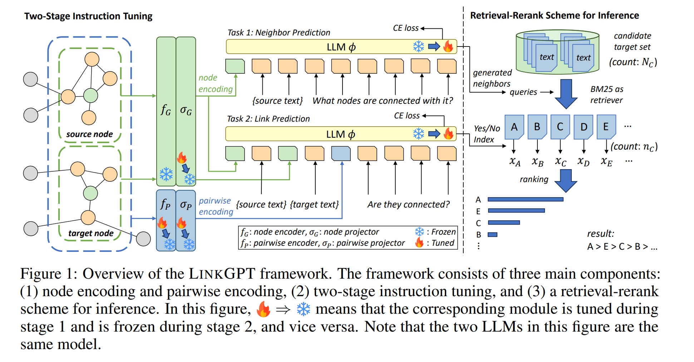
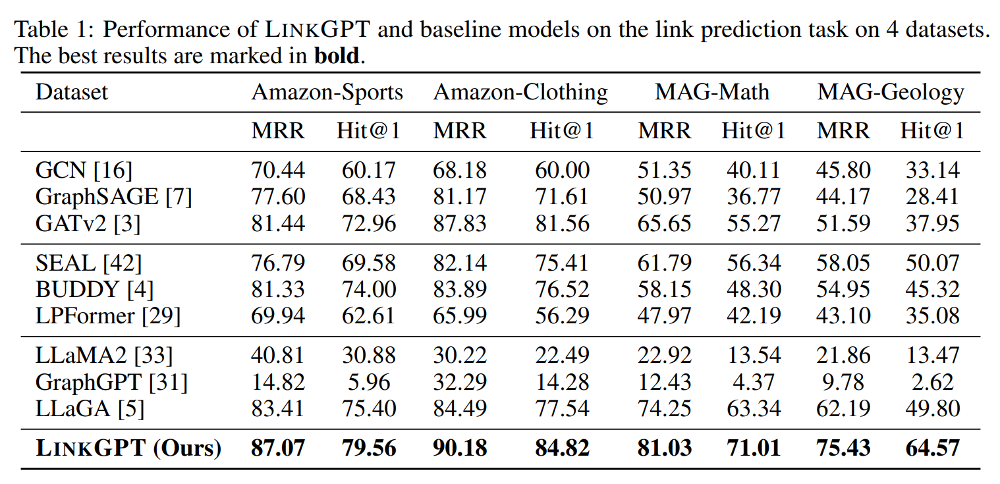
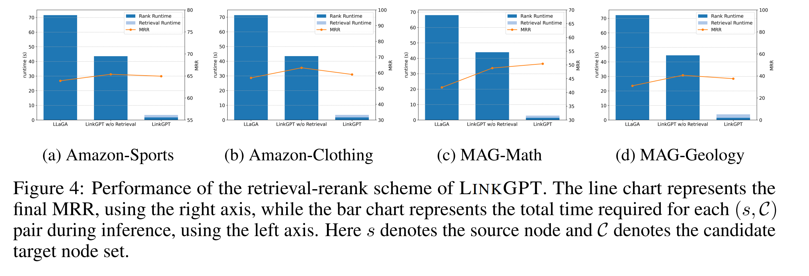

# LinkGPT for TAG4LP Datasets


<p align="center">
    <a href="https://arxiv.org/abs/2406.04640" alt="arXiv">
        </a>
    <a href="https://drive.google.com/file/d/1-_57MT-Mtp_oYnqSc0Kos7BpDBAyPuy5/view?usp=drive_link" alt="GoogleDrive Datasets">
        </a>
    <a href="https://drive.google.com/file/d/17h3ToYyZFp9dcQ9FJjLL6KT-KvrN1BpH/view?usp=sharing" alt="GoogleDrive Models">
        </a>
</p>

## Introduction

This repository uses LinkGPT framework as published in the paper [LinkGPT: Teaching Large Language Models To Predict Missing Links]( https://arxiv.org/abs/2406.04640 ) and the repository [LinkGPT](https://github.com/twelfth-star/LinkGPT) for performing prediction on the datasets mentioned in the [TAG4LP](https://github.com/ChenS676/TAG4LP) repository.




## Environment Preparation

```bash
# clone this repo
git clone https://github.com/Ani1211999/LinkGPT_for_TAG4LP_Datasets.git
cd LinkGPT

# create the conda environment
conda create -n linkgpt python=3.9
conda activate linkgpt

# install pytorch (refer to https://pytorch.org/get-started/previous-versions/ for other cuda versions)
pip3 install torch torchvision torchaudio --index-url https://download.pytorch.org/whl/cu118
# install other dependencies
pip install -r requirements.txt
```

## Data Preparation

Download the data from [here](https://drive.google.com/file/d/1-_57MT-Mtp_oYnqSc0Kos7BpDBAyPuy5/view?usp=drive_link) and extract it into `LinkGPT/data`. You may also save the data in any other location, but you will need to modify the `LINKGPT_DATA_PATH` variable in all scripts accordingly. The structure of the data should look like the following tree diagram.

```bash
.
└── datasets
    ├── amazon_clothing_20k
    │   ├── dataset_for_lm.pkl
    │   ├── eval_yn_dataset_0_examples.pkl
    │   ├── eval_yn_dataset_2_examples.pkl
    │   ├── eval_yn_dataset_4_examples.pkl
    │   ├── eval_yn_dataset_large_candidate_set.pkl
    │   ├── ft_np_dataset.pkl
    │   ├── ft_yn_dataset.pkl
    │   ├── ppr_data.pt
    │   └── text_emb_cgtp.pt
    ├── amazon_sports_20k
    │   └── ... (same as above)
    ├── mag_geology_20k
    │   └── ...
    └── mag_math_20k
        └── ...

```
For the TAG4LP Dataset move the dataset in a folder rag_data/ 


  
## Add/Edit Prompts
Add new prompts or update existing prompts in the dataset present in the _linkgpt/utils/prompts.py_ file.


Update the _get_prompts__() function for handling the new dataset prompts.


  
## Language Model Dataset Generator
1. Generate the dataset for language model by running the bash file _run_lm_dataset_generation.sh_ present in the _scripts/{dataset_name}_ folder.  

2. Edit the parameters like dataset name, text attributes etc. for TAGs and the dataset paths accordingly.
   


3. Run the file _generate_lm_dataset.py_ present in the _linkgpt/dataset/_ folder by executing the command in the terminal as shown below.
   
```bash
bash scripts/{dataset_name}/run_lm_dataset_generation.sh
```
4. If the script has successfully run, a file named _dataset_for_lm.pkl_ must be visible in the _data/datasets/{dataset_name}_ folder.

   

     

## Text Embeddings and PPR scores for Pairwise Encoders Generation
1. Generate the Personalized PageRank Scores - `ppr_data.pt` and Text Embeddings -`text_emb_cgtp.pt` files based on the Language Model Dataset `dataset_for_lm.pkl`.
2. Run the following command in the terminal. Refer to the script for more details.

```bash
bash scripts/{dataset_name}/preparation.sh
```
3. If the script has successfully run, two files named _ppr_data.pt_ and _text_emb_cgtp.pt_ for the Personalized PageRank Scores and Text Embeddings based on Contrastive Graph-Text preTraining will created in the _data/datasets/{dataset_name}_ folder.
   
   

  

## Link Prediction and Neighbor Prediction Dataset Generation
1. Generate the Link Prediction Dataset - `ft_yn_dataset.pkl` and  Neighbor Prediction Dataset - `ft_np_dataset.pkl` based on the Language Model Dataset - `dataset_for_lm.pkl`.
2. Change the parameter values for dataset name, text field attributes as per the Language Model Dataset accordingly in the bash file _run_np_lp_dataset_generation.sh_ present in the _scripts/{dataset_name}_ as per your dataset.
   
   

3. Execute the following command in the terminal-

```bash
bash scripts/{dataset_name}/run_np_lp_dataset_generation.sh
```

4. If the script has successfully run, two files named _ft_yn_dataset.pkl_ and _ft_np_dataset.pkl_ for the link prediction and neighbor prediction training tasks must be visible in the _data/datasets/{dataset_name}_ folder.
   
  
   
   

  
## Evaluation Dataset Generation
1. Generate the Evaluation Dataset - `eval_yn_dataset_4_examples.pkl`  based on the Language Model Dataset- `dataset_for_lm.pkl`.
2. Change the parameter values accordingly in the bash file _run_eval_dataset_generation.sh_ present in the _scripts/{dataset_name}_ as per your dataset.

   

3. Execute the following command in the terminal-

```bash
bash scripts/{dataset_name}/run_eval_dataset_generation.sh
```

4. If the script has successfully run, a file named _eval_yn_dataset_4_examples.pkl_ must be visible in the _data/datasets/{dataset_name}_ folder.
   
   
   

  
## Training

You may use the following command to train the model by yourself. The model checkpoints will be saved in `LinkGPT/data/models`.

```bash
bash scripts/{dataset_name}/train_linkgpt.sh
```

#Not Applicable for TAG4LP datasets
You may also download the fine-tuned models from [here](https://drive.google.com/file/d/17h3ToYyZFp9dcQ9FJjLL6KT-KvrN1BpH/view?usp=sharing
) and extract them into `LinkGPT/data`. T

The structure of the models should look like the following tree diagram.

```bash
└── models
    ├── amazon_clothing_20k
    │   └── linkgpt-llama2-7b-cgtp
    │       ├── stage1
    │       │   ├── linkgpt_special_token_emb.pt
    │       │   ├── lora_model
    │       │   │   ├── adapter_config.json
    │       │   │   ├── adapter_model.safetensors
    │       │   │   └── README.md
    │       │   ├── node_alignment_proj.pt
    │       │   ├── pairwise_alignment_proj.pt
    │       │   └── pairwise_encoder.pt
    │       └── stage2
    │           └── ... (same as stage1)
    ├── amazon_sports_20k
    │   └── ... (same as above)
    ├── mag_geology_20k
    │   └── ...
    └── mag_math_20k
        └── ...
```

## Evaluation



To reproduce the results in Table 1 (LinkGPT w/o retrieval), you may use the following command to evaluate the model. The evaluation results will be saved in `LinkGPT/data/eval_output`.
 
```bash
bash scripts/{dataset_name}/eval_rank.sh
```



To reproduce the results in Figure 4 (LinkGPT w/ retrieval), you may use the following commands to evaluate the model. The evaluation results will also be saved in `LinkGPT/data/eval_output`.

```bash
bash scripts/{dataset_name}/eval_retrieval_rerank.sh
```

## Citation

```bibtex
@article{he2024linkgpt,
  title={LinkGPT: Teaching Large Language Models To Predict Missing Links},
  author={He, Zhongmou and Zhu, Jing and Qian, Shengyi and Chai, Joyce and Koutra, Danai},
  journal={arXiv preprint arXiv:2406.04640},
  year={2024}
}
```
